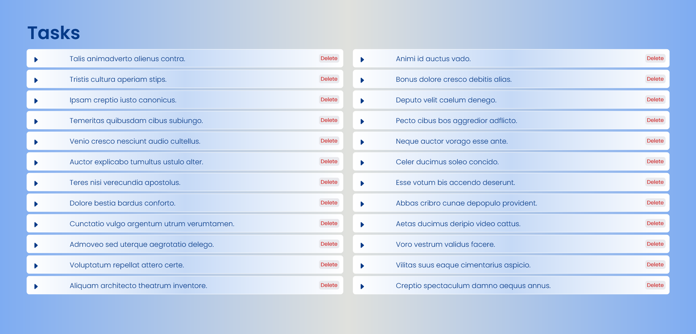
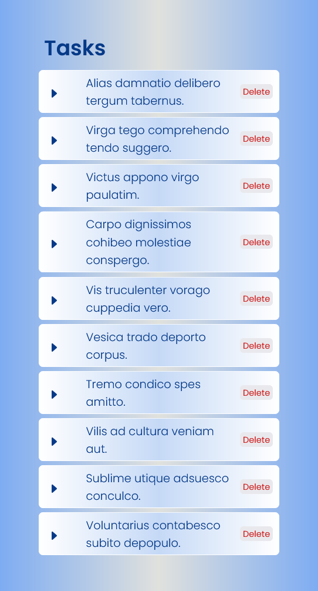

# Task Management Application 
This is a simple react project with tasks. tasks can be viewed as a list and can be deleted. here used the auto generated data, to generate auto data used faker. 

### Project setup
1. clone the project
2. install dependencies 
3. run application using 'npm start' command

## Desktop view

### Mobile view

